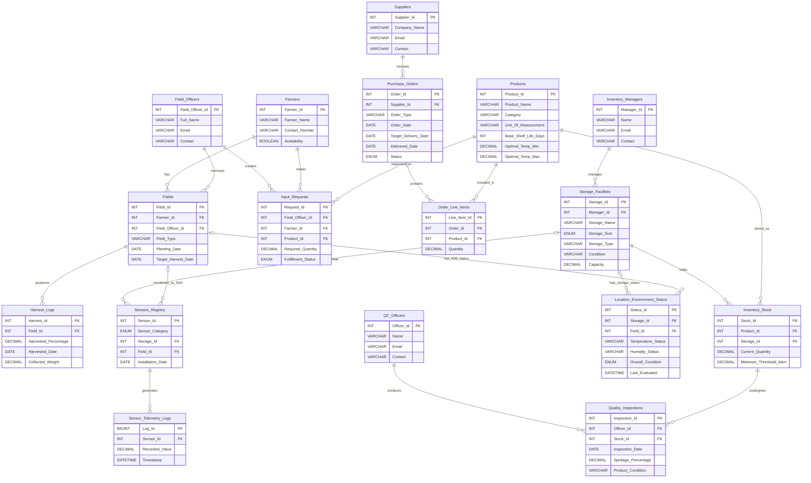

You are GitHub Copilot Agent running GPT-5.3-Codex Xhigh. Complete my DBMS project end-to-end inside this workspace.

Project title:
Inventory Management for Agricultural Products

Main goal:
Build a complete full-stack DBMS project on XAMPP using my existing frontend HTML/CSS pages as the base UI. Create the MySQL/MariaDB database from the ER diagram, add realistic dummy data, and turn the static frontend into a working CRUD website.

Tech stack and environment:
- XAMPP only
- PHP 8+
- MySQL/MariaDB
- Apache
- HTML, CSS, vanilla JavaScript
- PDO for database access
- No Laravel, no Node.js, no React, no external backend frameworks
- Keep it simple, clean, and runnable locally in XAMPP

Important instructions:
1. Reuse and refactor my existing static HTML pages instead of throwing them away.
2. Convert the static pages into dynamic PHP pages with shared layout/includes.
3. Keep the current visual design/style as much as possible, but improve it where necessary.
4. Modify the frontend where needed so the system fully supports the ER diagram and the roles:
   - Field Officer
   - Inventory Manager
   - Supplier
   - Quality Control Officer
   - IoT / Sensors
5. Create the complete database schema, foreign keys, indexes, seed data, and all CRUD operations.
6. Do not leave placeholder pages or hardcoded dummy rows in the final app. All tables and dashboard values must come from the database.
7. If role-based access needs login/session handling, add a minimal supporting `users` table for authentication only. Do not distort the core business schema from the ER diagram.
8. Use prepared statements everywhere, validate all form input, escape output, and make the app stable enough for a university demo.
9. Make reasonable assumptions where enum values or app details are missing, document them in README, and continue without asking unnecessary questions.
10. Finish the project completely, not just scaffolding.

Existing frontend files to reuse/refactor:
- index.html
- field_operations.html
- product_catalog.html
- supplier_management.html
- inventory_storage.html
- iot_network.html
- quality_control.html

Use these pages as the UI reference and convert them into reusable PHP modules with shared:
- header
- sidebar
- footer
- database config
- auth/session handling if added

Business flow from the rich picture:
- Field Officer sends harvest data and input requests
- Inventory Manager receives stock level alerts and manages stock movement
- Supplier handles orders, deliveries, and order status
- IoT/Sensors provide real-time temperature/humidity and telemetry data
- Quality Control Officer records quality status and spoilage reports
Design the app around these flows.

Very important implementation note:
The ER diagram uses INT primary keys, but my current HTML mockups show IDs like FO-01, PRD-1001, STK-5001, etc.
Do this:
- Keep the real database primary keys as integers / bigint auto increment according to the ER diagram
- In the UI, optionally format them into display codes like FO-01, PRD-1001, STK-5001 using PHP helper functions
- Do not change the database PK type to strings just because the mockup shows formatted labels

Core source of truth: ER diagram

Database design rules:
- Use lowercase snake_case table and column names in SQL if cleaner, but preserve a one-to-one mapping to the ER entities
- Use InnoDB and foreign keys
- Add useful indexes on foreign keys and searchable fields
- Use AUTO_INCREMENT for integer IDs and BIGINT AUTO_INCREMENT for telemetry log IDs
- Use reasonable DECIMAL precision
- Use sensible enum values and document them
- Add created/updated timestamps only if useful, but do not break the original business schema
- The core business schema must follow the ER diagram faithfully

Suggested enum values:
- input_requests.fulfillment_status: pending, approved, fulfilled, rejected
- purchase_orders.status: pending, processing, delivered, cancelled
- storage_facilities.storage_size: small, medium, large
- sensors_registry.sensor_category: temperature, humidity, weight, moisture, gas
- location_environment_status.overall_condition: secure, monitor, critical

Important data integrity rules:
- A sensor can belong to a storage facility or a field. At least one of `storage_id` or `field_id` must be set.
- A location environment status row can belong to a storage facility or a field. At least one of `storage_id` or `field_id` must be set.
- Quality inspections must reference `stock_id`, not product_id directly.
- Therefore, update the Quality Control UI so the inspection form selects a stock record, but display it as “Product Name + Storage Name” for user friendliness.
- Use application-level validation if a database CHECK is not reliable in the local MySQL/MariaDB version.

Required seed data:
Create realistic demo data that fully exercises relationships.
Minimum suggestion:
- 5 field officers
- 10 farmers
- 12 fields
- 15 harvest logs
- 15 products
- 5 suppliers
- 10 purchase orders
- 20 order line items
- 4 inventory managers
- 6 storage facilities
- 20 inventory stock rows
- 10 sensors
- 120+ sensor telemetry logs
- 10 location environment status rows
- 4 QC officers
- 15 quality inspections
- demo users for each role if auth is added

Make the seed data relationally consistent and useful for joins, dashboard metrics, alerts, and CRUD testing.

Role-wise application behavior:
1. Admin
   - full access to all modules and CRUD operations

2. Field Officer
   - manage/view farmers
   - manage/view fields
   - create/view harvest logs
   - create/view input requests
   - see field-related sensors and environment status

3. Inventory Manager
   - manage/view products
   - manage/view storage facilities
   - manage/view inventory stock
   - receive stock alerts
   - manage supplier purchase orders
   - optionally process deliveries into inventory stock

4. Supplier
   - view supplier profile
   - view assigned purchase orders
   - view order line items
   - optionally update delivery status/date for supplier-facing demo pages

5. Quality Control Officer
   - manage/view QC officers
   - create/view/update quality inspections
   - view stock quality condition and spoilage records

6. IoT / Sensors
   - manage sensor registry
   - add/view telemetry logs
   - view computed environment status
   - this can be a system/simulator module if you do not want a normal human login

Module/page mapping to implement:
1. Dashboard Home
   - dynamic summary cards
   - pending input requests count
   - low stock alert count
   - active sensor count
   - recent purchase orders
   - recent inspections
   - recent telemetry / condition alerts
   - all values must come from live database queries

2. Field Operations
   - field officers CRUD
   - farmers CRUD
   - fields CRUD
   - harvest logs CRUD
   - input requests CRUD
   - joined tables showing officer name, farmer name, product name, field details

3. Product Catalog
   - products CRUD
   - product search/filter by category or name
   - show shelf life and optimal temperature range

4. Supplier Management
   - suppliers CRUD
   - purchase orders CRUD
   - order line items CRUD
   - purchase order form must support multiple line items
   - show supplier names instead of only IDs

5. Inventory & Storage
   - inventory managers CRUD
   - storage facilities CRUD
   - inventory stock CRUD
   - low stock highlighting when current_quantity <= minimum_threshold_alert
   - show facility manager names and storage details
   - optionally show utilization hints based on storage capacity

6. IoT Sensor Network
   - sensors registry CRUD
   - telemetry logs CRUD or at least create/read/delete
   - environment status CRUD or computed update flow
   - location-aware UI for either field or storage assignment
   - recent telemetry table
   - status badges for temperature/humidity/overall condition

7. Quality Control
   - QC officers CRUD
   - quality inspections CRUD
   - inspection history table
   - inspection form must use stock reference, then display related product/storage by join
   - condition badges and spoilage summary

Business logic to implement:
- Low stock alert when `current_quantity <= minimum_threshold_alert`
- When purchase order status becomes `delivered`, set `delivered_date`
- Optionally add a “Receive into Stock” flow so delivered line items can increase inventory in a selected storage facility
- After inserting telemetry, update or recompute the corresponding location_environment_status
- For temperature-related status, compare telemetry and product/storage context where reasonable
- Show latest alerts or warnings in dashboard cards/tables
- Use joins everywhere so the UI is readable

Frontend/UI requirements:
- Preserve my existing layout/look as much as possible
- Move duplicated inline CSS into shared assets where practical
- Shared sidebar and top header across modules
- Active nav highlighting
- Tables with search/filter where useful
- Create/edit forms
- Delete confirmation prompts
- Flash success/error messages
- Color-coded status badges similar to the existing mockups
- Desktop-first layout is fine
- Avoid hardcoded rows once database integration is done

CRUD requirements:
- Every main entity must have working create, read, update, delete flows
- Foreign keys should use dropdowns/selects in forms
- Pre-fill edit forms correctly
- Validate required fields server-side
- Show friendly validation messages
- Prevent destructive deletes that break foreign key integrity; either block them cleanly or handle them safely

Authentication/session requirement:
- If you add auth, create a simple login page with seeded demo accounts
- Use PHP sessions
- Use role guards for navigation and actions
- Minimal `users` table is allowed only as a supporting app table
- Seed demo users such as:
  - admin
  - field_officer
  - inventory_manager
  - supplier
  - qc_officer
  - iot
- Store hashed passwords, not plain text

Expected project structure:
Create a clean XAMPP-ready project, for example:

/project-root
  /assets
    /css
    /js
  /config
    database.php
  /includes
    header.php
    sidebar.php
    footer.php
    auth.php
    helpers.php
  /modules
    dashboard.php
    field_operations.php
    products.php
    suppliers.php
    purchase_orders.php
    inventory.php
    storage.php
    sensors.php
    telemetry.php
    environment_status.php
    quality_control.php
  /database
    agri_inventory_management.sql
  /auth
    login.php
    logout.php
  index.php
  README.md

A cleaner equivalent structure is also acceptable, but the final result must be organized and runnable.

SQL deliverable:
Create:
- `database/agri_inventory_management.sql`

This SQL file must:
- create the database
- create all tables
- define foreign keys
- insert seed data
- be importable directly into phpMyAdmin in XAMPP

README requirements:
Write a README.md with:
- project overview
- folder structure
- database import steps in phpMyAdmin
- where to place the project in `htdocs`
- how to edit DB credentials
- demo login credentials
- how to run the app locally
- any assumptions you made

Acceptance criteria:
The project is complete only when:
1. The SQL imports successfully in XAMPP/phpMyAdmin
2. The PHP website runs on localhost through XAMPP
3. The dashboard is dynamic
4. CRUD works across the major tables
5. My existing HTML pages have been converted into real data-driven pages
6. Role-based views/navigation work if auth was added
7. Seed data shows meaningful relationships and alerts
8. No final page is just static mock data

Execution plan:
1. Inspect the existing HTML files in the workspace
2. Create the database SQL schema and seed data
3. Refactor the shared frontend layout into includes/templates
4. Build the PHP pages module by module
5. Connect all forms and tables to PDO queries
6. Add role-wise navigation and session handling if used
7. Test the major CRUD flows
8. Write/update README
9. Leave the workspace in a runnable state

Do not stop after planning.
Do not only generate sample code snippets.
Actually create and wire the files needed for the project.
When done, provide a short summary of what was created and any assumptions.